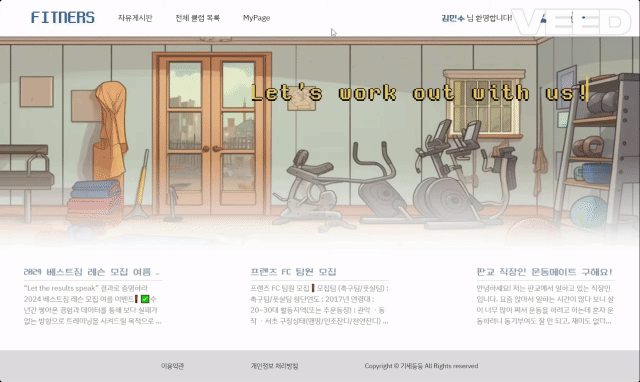
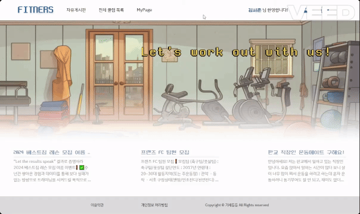

## 🦾 운동 메이트를 구하고 일정을 공유하는 소셜 피트니스 플랫폼


## 프로젝트 소개

- FITNERS는 운동을 좋아하는 사람들이 다른 사람들과 운동경험과 정보를 공유하고, 함께 운동할 메이트를 구할 수 있는 서비스입니다.
- 운동을 함께할 메이트와 그룹을 만들어 그룹별 페이지를 사용할 수 있습니다. 그룹별로 공지사항을 빠르게 공유할 수 있고 단체 일정을 만들고 이를 개인 일정에 추가할 수 있습니다.
- 모든 유저들은 그룹페이지나 마이페이지 외에도 자유게시판을 이용할 수 있습니다. 자유게시판을 통해 수많은 유저들과 운동경험이나 정보를 공유할 수 있습니다.
  <br>

## 팀원 구성

<div align="center">

|                                                         **김기창**                                                          |                                                        **임세하**                                                        |
| :-------------------------------------------------------------------------------------------------------------------------: | :----------------------------------------------------------------------------------------------------------------------: |
| [ <br/> @kgc9007](https://github.com/kgc9007) | [ <br/> @sehaim](https://github.com/sehaim) |

</div>

<br>

## 1. 개발 환경 및 기술

- Front
  - 
    
    
    
    
- Back-end
  - 
    
- DBMS
  - 
- 버전 및 이슈관리, 협업
  - 
    
    
- 디자인
  - 카카오 오븐

## 2. 주요 기술과 브랜치 전략

### Java, Spring

- Spring Boot 환경을 이용하여 백엔드 개발 진행
- 컨트롤러, 서비스, DAO, DTO 등으로 구분하여 REST API 개발
- MyBatis, Swagger 등의 프레임워크를 활용

### Vue

- Vue.js를 사용하여 컴포넌트 기반 구조의 UI 구축
- Vue Router를 사용한 SPA(Single Page Application) 구조로 개발 진행
- Axios를 사용하여 비동기 요청을 통해 백엔드 API와의 통신을 처리하여 데이터를 주고 받고 UI와 데이터 동기화 유지

### 브랜치 전략

- master 브랜치와 feature, fix, test 브랜치로 나누어 개발을 하였습니다.
  - **master** 브랜치는 오류가 없이 정상 작동하는 경우에만 merge하도록 하였습니다. 일반적인 git flow의 develop 브랜치의 역할입니다.
  - **feat** 브랜치는 기능 단위로 개발을 진행하기 위해 사용한 브랜치로 **feat\_작성자** 형태로 브랜치를 만들어 작업 후 해당 기능 브랜치에 merge하도록 하였습니다.
  - **fix**는 master 브랜치 merge 후 발생한 오류를 수정하는 경우 사용하였습니다.
  - **test**는 임시 데이터 추가, 서비스 로직 관련 테스트 진행에 사용하였습니다.

<br>

## 3. 프로젝트 구조

<details>
<summary>전체구조</summary>
<div markdown="1">

```
📦FITNERS
 ┣ 📂.metadata
 ┣ 📂assets
 ┃ ┗ 📂DB
 ┃ ┃ ┣ 📜erd.mwb
 ┃ ┃ ┣ 📜schema.sql
 ┃ ┃ ┗ 📜sampledata.sql
 ┣ 📂documents
 ┃ ┗ 📂scrum
 ┣ 📂ssafit-vue-project
 ┣ 📂SsafitProject
 ┣ 📂test
 ┣ 📜.gitignore
 ┗ 📜README.md

```

</div>
</details>

<details>
<summary>BACK-END</summary>
<div markdown="1">

```
📦SsafitProject
 ┣ 📂.mvn
 ┃ ┗ 📂wrapper
 ┃ ┃ ┣ 📜maven-wrapper.jar
 ┃ ┃ ┗ 📜maven-wrapper.properties
 ┣ 📂.settings
 ┃ ┣ 📜org.eclipse.core.resources.prefs
 ┃ ┣ 📜org.eclipse.jdt.apt.core.prefs
 ┃ ┣ 📜org.eclipse.jdt.core.prefs
 ┃ ┣ 📜org.eclipse.m2e.core.prefs
 ┃ ┗ 📜org.springframework.ide.eclipse.prefs
 ┣ 📂src
 ┃ ┣ 📂main
 ┃ ┃ ┣ 📂java
 ┃ ┃ ┃ ┗ 📂com
 ┃ ┃ ┃ ┃ ┗ 📂ssafit
 ┃ ┃ ┃ ┃ ┃ ┣ 📂config
 ┃ ┃ ┃ ┃ ┃ ┃ ┣ 📜DBConfig.java
 ┃ ┃ ┃ ┃ ┃ ┃ ┣ 📜SwaggerConfig.java
 ┃ ┃ ┃ ┃ ┃ ┃ ┗ 📜WebConfig.java
 ┃ ┃ ┃ ┃ ┃ ┣ 📂controller
 ┃ ┃ ┃ ┃ ┃ ┃ ┣ 📜BoardRestController.java
 ┃ ┃ ┃ ┃ ┃ ┃ ┣ 📜ClubBoardRestController.java
 ┃ ┃ ┃ ┃ ┃ ┃ ┣ 📜ClubRestController.java
 ┃ ┃ ┃ ┃ ┃ ┃ ┣ 📜MyPageRestController.java
 ┃ ┃ ┃ ┃ ┃ ┃ ┗ 📜UserRestController.java
 ┃ ┃ ┃ ┃ ┃ ┣ 📂interceptor
 ┃ ┃ ┃ ┃ ┃ ┃ ┗ 📜JwtInterceptor.java
 ┃ ┃ ┃ ┃ ┃ ┣ 📂model
 ┃ ┃ ┃ ┃ ┃ ┃ ┣ 📂dao
 ┃ ┃ ┃ ┃ ┃ ┃ ┃ ┣ 📜BoardDao.java
 ┃ ┃ ┃ ┃ ┃ ┃ ┃ ┣ 📜ClubBoardDao.java
 ┃ ┃ ┃ ┃ ┃ ┃ ┃ ┣ 📜ClubDao.java
 ┃ ┃ ┃ ┃ ┃ ┃ ┃ ┣ 📜MemberDao.java
 ┃ ┃ ┃ ┃ ┃ ┃ ┃ ┣ 📜ScheduleDao.java
 ┃ ┃ ┃ ┃ ┃ ┃ ┃ ┗ 📜UserDao.java
 ┃ ┃ ┃ ┃ ┃ ┃ ┣ 📂dto
 ┃ ┃ ┃ ┃ ┃ ┃ ┃ ┣ 📜Board.java
 ┃ ┃ ┃ ┃ ┃ ┃ ┃ ┣ 📜Club.java
 ┃ ┃ ┃ ┃ ┃ ┃ ┃ ┣ 📜ClubBoard.java
 ┃ ┃ ┃ ┃ ┃ ┃ ┃ ┣ 📜ClubBoardSearchResult.java
 ┃ ┃ ┃ ┃ ┃ ┃ ┃ ┣ 📜ClubSchedule.java
 ┃ ┃ ┃ ┃ ┃ ┃ ┃ ┣ 📜ClubSearchResult.java
 ┃ ┃ ┃ ┃ ┃ ┃ ┃ ┣ 📜LoginForm.java
 ┃ ┃ ┃ ┃ ┃ ┃ ┃ ┣ 📜Member.java
 ┃ ┃ ┃ ┃ ┃ ┃ ┃ ┣ 📜MemberRegist.java
 ┃ ┃ ┃ ┃ ┃ ┃ ┃ ┣ 📜Schedule.java
 ┃ ┃ ┃ ┃ ┃ ┃ ┃ ┣ 📜User.java
 ┃ ┃ ┃ ┃ ┃ ┃ ┃ ┣ 📜UserSchedule.java
 ┃ ┃ ┃ ┃ ┃ ┃ ┃ ┗ 📜UserScheduleSearchResult.java
 ┃ ┃ ┃ ┃ ┃ ┃ ┗ 📂service
 ┃ ┃ ┃ ┃ ┃ ┃ ┃ ┣ 📜BoardService.java
 ┃ ┃ ┃ ┃ ┃ ┃ ┃ ┣ 📜BoardServiceImpl.java
 ┃ ┃ ┃ ┃ ┃ ┃ ┃ ┣ 📜ClubBoardService.java
 ┃ ┃ ┃ ┃ ┃ ┃ ┃ ┣ 📜ClubBoardServiceImpl.java
 ┃ ┃ ┃ ┃ ┃ ┃ ┃ ┣ 📜ClubService.java
 ┃ ┃ ┃ ┃ ┃ ┃ ┃ ┣ 📜ClubServiceImpl.java
 ┃ ┃ ┃ ┃ ┃ ┃ ┃ ┣ 📜MemberService.java
 ┃ ┃ ┃ ┃ ┃ ┃ ┃ ┣ 📜MemberServiceImpl.java
 ┃ ┃ ┃ ┃ ┃ ┃ ┃ ┣ 📜ScheduleService.java
 ┃ ┃ ┃ ┃ ┃ ┃ ┃ ┣ 📜ScheduleServiceImpl.java
 ┃ ┃ ┃ ┃ ┃ ┃ ┃ ┣ 📜UserService.java
 ┃ ┃ ┃ ┃ ┃ ┃ ┃ ┗ 📜UserServiceImpl.java
 ┃ ┃ ┃ ┃ ┃ ┣ 📂util
 ┃ ┃ ┃ ┃ ┃ ┃ ┗ 📜JwtUtil.java
 ┃ ┃ ┃ ┃ ┃ ┗ 📜SsafitProjectApplication.java
 ┃ ┃ ┗ 📂resources
 ┃ ┃ ┃ ┣ 📂mappers
 ┃ ┃ ┃ ┃ ┣ 📜boardMapper.xml
 ┃ ┃ ┃ ┃ ┣ 📜clubBoardMapper.xml
 ┃ ┃ ┃ ┃ ┣ 📜clubMapper.xml
 ┃ ┃ ┃ ┃ ┣ 📜memberMapper.xml
 ┃ ┃ ┃ ┃ ┣ 📜scheduleMapper.xml
 ┃ ┃ ┃ ┃ ┗ 📜userMapper.xml
 ┃ ┃ ┃ ┗ 📜application.properties
 ┃ ┗ 📂test
 ┃ ┃ ┗ 📂java
 ┃ ┃ ┃ ┗ 📂com
 ┃ ┃ ┃ ┃ ┗ 📂ssafit
 ┃ ┃ ┃ ┃ ┃ ┗ 📜SsafitProjectApplicationTests.java
 ┣ 📂target
 ┃ ┣ 📂classes
 ┃ ┃ ┣ 📂com
 ┃ ┃ ┃ ┗ 📂ssafit
 ┃ ┃ ┃ ┃ ┣ 📂...
 ┃ ┃ ┃ ┃ ┣ 📂...
 ┃ ┃ ┃ ┃ ┣ 📂...
 ┃ ┃ ┃ ┃ ┗ 📜SsafitProjectApplication.class
 ┃ ┃ ┣ 📂mappers
 ┃ ┃ ┃ ┣ 📜boardMapper.xml
 ┃ ┃ ┃ ┃    .
 ┃ ┃ ┃ ┃    .
 ┃ ┃ ┃ ┃    .
 ┃ ┃ ┃ ┗ 📜userMapper.xml
 ┃ ┃ ┣ 📂META-INF
 ┃ ┃ ┃ ┣ 📂maven
 ┃ ┃ ┃ ┃ ┗ 📂com.ssafit
 ┃ ┃ ┃ ┃ ┃ ┗ 📂SsafitProject
 ┃ ┃ ┃ ┃ ┃ ┃ ┣ 📜pom.properties
 ┃ ┃ ┃ ┃ ┃ ┃ ┗ 📜pom.xml
 ┃ ┃ ┃ ┗ 📜MANIFEST.MF
 ┃ ┃ ┗ 📜application.properties
 ┃ ┗ 📂test-classes
 ┃ ┃ ┗ 📂com
 ┃ ┃ ┃ ┗ 📂ssafit
 ┃ ┃ ┃ ┃ ┗ 📜SsafitProjectApplicationTests.class
 ┣ 📜.classpath
 ┣ 📜.gitignore
 ┣ 📜.project
 ┣ 📜mvnw
 ┣ 📜mvnw.cmd
 ┗ 📜pom.xml
```

</div>
</details>

<details>
<summary>FRONT-END</summary>
<div markdown="1">

```
📦ssafit-vue-project
 ┣ 📂.vscode
 ┃ ┗ 📜extensions.json
 ┣ 📂node_modules
 ┃       .
 ┃       .
 ┃       .
 ┣ 📂public
 ┃ ┗ 📜favicon.ico
 ┣ 📂src
 ┃ ┣ 📂assets
 ┃ ┃ ┣ 📂font
 ┃ ┃ ┃ ┗ 📜neodgm.woff
 ┃ ┃ ┣ 📂img
 ┃ ┃ ┃ ┣ 📜add-check-icon.png
 ┃ ┃ ┃ ┣ 📜clock-icon.png
 ┃ ┃ ┃ ┣ 📜club-list-icon.png
 ┃ ┃ ┃ ┣ 📜gear-icon.png
 ┃ ┃ ┃ ┣ 📜home-image.jpg
 ┃ ┃ ┃ ┣ 📜myclub-icon.png
 ┃ ┃ ┃ ┣ 📜mymember-icon.png
 ┃ ┃ ┃ ┣ 📜myschedule-icon.png
 ┃ ┃ ┃ ┣ 📜notice-icon.png
 ┃ ┃ ┃ ┣ 📜sad-icon.png
 ┃ ┃ ┃ ┗ 📜schedule-icon.png
 ┃ ┃ ┗ 📜style.css
 ┃ ┣ 📂components
 ┃ ┃ ┣ 📂board
 ┃ ┃ ┃ ┣ 📜BoardCreate.vue
 ┃ ┃ ┃ ┣ 📜BoardDetail.vue
 ┃ ┃ ┃ ┣ 📜BoardList.vue
 ┃ ┃ ┃ ┗ 📜BoardUpdate.vue
 ┃ ┃ ┣ 📂club
 ┃ ┃ ┃ ┣ 📜ClubBoard.vue
 ┃ ┃ ┃ ┣ 📜ClubBoardDetail.vue
 ┃ ┃ ┃ ┣ 📜ClubBoardUpdate.vue
 ┃ ┃ ┃ ┣ 📜ClubDetail.vue
 ┃ ┃ ┃ ┣ 📜ClubList.vue
 ┃ ┃ ┃ ┣ 📜ClubListItem.vue
 ┃ ┃ ┃ ┣ 📜ClubManagerNone.vue
 ┃ ┃ ┃ ┣ 📜ClubMemberDetail.vue
 ┃ ┃ ┃ ┣ 📜ClubMemberNone.vue
 ┃ ┃ ┃ ┣ 📜ClubMemberProceeding.vue
 ┃ ┃ ┃ ┣ 📜ClubSchedule.vue
 ┃ ┃ ┃ ┣ 📜ClubScheduleManager.vue
 ┃ ┃ ┃ ┣ 📜ClubScheduleManagerItem.vue
 ┃ ┃ ┃ ┣ 📜ClubScheduleRegist.vue
 ┃ ┃ ┃ ┣ 📜ClubScheduleUser.vue
 ┃ ┃ ┃ ┣ 📜ClubScheduleUserItem.vue
 ┃ ┃ ┃ ┗ 📜ClubToMypage.vue
 ┃ ┃ ┣ 📂common
 ┃ ┃ ┃ ┣ 📜TheFooterNav.vue
 ┃ ┃ ┃ ┗ 📜TheHeaderNav.vue
 ┃ ┃ ┣ 📂error
 ┃ ┃ ┃ ┗ 📜notFound.vue
 ┃ ┃ ┣ 📂home
 ┃ ┃ ┃ ┣ 📜Home.vue
 ┃ ┃ ┃ ┣ 📜HomeHotBoardList.vue
 ┃ ┃ ┃ ┗ 📜HomeHotBoardListItem.vue
 ┃ ┃ ┣ 📂mypage
 ┃ ┃ ┃ ┣ 📜MyClub.vue
 ┃ ┃ ┃ ┣ 📜MyClubAdd.vue
 ┃ ┃ ┃ ┣ 📜MyClubList.vue
 ┃ ┃ ┃ ┣ 📜MyClubListItem.vue
 ┃ ┃ ┃ ┣ 📜MyMember.vue
 ┃ ┃ ┃ ┣ 📜MyMemberList.vue
 ┃ ┃ ┃ ┣ 📜MyMemberListByClub.vue
 ┃ ┃ ┃ ┣ 📜MyMemberListItem.vue
 ┃ ┃ ┃ ┣ 📜MyPage.vue
 ┃ ┃ ┃ ┣ 📜MySchedule.vue
 ┃ ┃ ┃ ┣ 📜MyScheduleList.vue
 ┃ ┃ ┃ ┣ 📜MyScheduleListByClub.vue
 ┃ ┃ ┃ ┗ 📜MyScheduleListItem.vue
 ┃ ┃ ┗ 📂user
 ┃ ┃ ┃ ┣ 📜Login.vue
 ┃ ┃ ┃ ┗ 📜Signup.vue
 ┃ ┣ 📂router
 ┃ ┃ ┗ 📜index.js
 ┃ ┣ 📂stores
 ┃ ┃ ┣ 📜board.js
 ┃ ┃ ┣ 📜club.js
 ┃ ┃ ┣ 📜home.js
 ┃ ┃ ┣ 📜mypage.js
 ┃ ┃ ┗ 📜user.js
 ┃ ┣ 📂views
 ┃ ┃ ┣ 📜BoardView.vue
 ┃ ┃ ┣ 📜ClubView.vue
 ┃ ┃ ┣ 📜HomeView.vue
 ┃ ┃ ┣ 📜LoginView.vue
 ┃ ┃ ┣ 📜MyPageView.vue
 ┃ ┃ ┣ 📜NotFoundView.vue
 ┃ ┃ ┗ 📜SignupView.vue
 ┃ ┣ 📜App.vue
 ┃ ┗ 📜main.js
 ┣ 📜.gitignore
 ┣ 📜index.html
 ┣ 📜jsconfig.json
 ┣ 📜package-lock.json
 ┣ 📜package.json
 ┣ 📜README.md
 ┗ 📜vite.config.js

```

</div>
</details>

<br>

## 4. 역할 분담

### 🎓김기창

- **Back-End**
  - 회원 관리 기능
    - 회원가입, 로그인/로그아웃
  - 클럽 및 클럽 멤버, 일정 관리 기능
    - 클럽 추가, 조회, 삭제
    - 클럽 가입 승인, 거절
    - 클럽 일정 추가, 삭제
    - 클럽 공지사항 등록, 수정
  - 내 클럽, 일정 관리 기능
    - 클럽 가입 신청
    - 내 일정 추가, 삭제
  - 게시글 관리 기능
    - 게시글 등록 및 수정, 상세 확인, 삭제
    - 인기 게시글 조회
- **Front-End**
  - 게시판 페이지
    - 게시글 등록 및 수정, 상세 확인, 삭제
- **기획**
  - 기능 명세서, API 명세서 작성, ERD 및 스키마, 더미데이터 작성

<br>
    
### 🎓임세하

- **Front-End**
  - 페이지 : 프로필 설정, 프로필 수정, 팔로잉&팔로워 리스트, 상품 등록, 상품 수정, 채팅 목록, 404 페이지
  - 회원가입, 로그인/로그아웃 페이지
  - 클럽 페이지 - 공통
    - 클럽 목록 조회
  - 클럽 페이지 - 매니저
    - 클럽 가입 승인, 거절
    - 클럽 일정 추가, 삭제
    - 클럽 공지사항 등록, 수정
  - 클럽 페이지 - 일반 사용자
    - 클럽 가입 신청
    - 클럽 일정 조회
    - 클럽 공지사항 조회
  - 마이페이지 - 공통
    - 내 클럽, 일정 조회
  - 마이페이지 - 매니저
    - 클럽 추가, 삭제
  - 마이페이지 - 일반 사용자
    - 내 클럽 조회
    - 내 일정 조회, 삭제
- **Back-End**
  - 컨트롤러 및 서비스 테스트 진행, 일부 수정
- **기획**
  - 목업 작성, API 명세서 작성, ERD 및 스키마 작성

<br>

## 5. 개발 기간 및 작업 관리

### 개발 기간

- 전체 개발 기간 : 2024-04-22 ~ 2022-05-24
- 기획 : 2024-04-22 ~ 2022-05-11
- 기능 및 UI 개발 : 2024-05-12 ~ 2022-05-21
- 테스트 : 2024-05-21 ~ 2022-05-23

<br>

### 작업 관리

- GitHub와 Notion을 사용하여 진행 상황을 공유했습니다.
- Daily Scrum을 진행하며 현재 작업 상황에 대해 주기적으로 공유하고 작업 순서나 방향성에 대해 함께 고민하며 이를 markdown 파일로 기록했습니다.

<br>

## 6. 페이지별 기능

**홈 화면** <br>

- 홈 화면 로드시 최근 일주일 내에 작성된 게시글 중 조회수 상위 3건 미리보기


<br>

**회원가입 화면** <br>

- 아이디, 이름, 비밀번호, 회원 유형 입력 후 회원 등록
- 아이디, 비밀번호, 비밀번호 확인 후 유효하지 않으면 등록 X, 알림창 출력


<br>

**로그인 화면** <br>

- 아이디, 비밀번호를 입력하여 로그인


<br>

**게시글 전체보기/상세보기/검색 화면** <br>

- 게시글 전체조회 기능 구현
- 게시글 상세조회 기능 구현
- 게시글 검색 기능 구현



<br>

**유저 마이페이지 화면** <br>

- 유저(일반사용자)로 로그인한 경우 마이페이지 화면
- 내가 속한 클럽 조회 기능 구현
- 내 일정 조회, 삭제 기능 구현
- 클럽 페이지 이동 후 해당 클럽 정보 조회 기능 구현
- 해당 클럽 일정 조회 후 내 일정에 추가하기 기능 구현



<br>

**유저 클럽목록 화면** <br>

- 유저(일반사용자)로 로그인한 경우 전체 클럽목록 화면
- 전체 클럽 목록 조회 기능 구현
- 클럽 상세 페이지로 이동시
  - 미가입 클럽 -> 가입 요청 화면
  - 가입 요청 상태 -> 승인 대기중 화면
  - 가입 상태 -> 클럽 상세 페이지
- 클럽 상세 페이지에서 클럽 일정, 클럽 공지사항 조회 가능
- 클럽 일정을 내 일정에 추가하기 기능 구현


<br>

**관리자 마이페이지 화면** <br>

- 관리자로 로그인한 경우 마이페이지 화면
- 내가 관리하는 클럽 조회, 클럽 추가 기능 구현
- 클럽 가입 신청 승인, 거절 기능 구현
- 클럽 페이지 이동 후 해당 클럽 정보 조회 기능 구현


<br>

**관리자 클럽목록 화면** <br>

- 관리자로 로그인한 경우 전체 클럽목록 화면
- 클럽 상세 페이지로 이동시
  - 내 클럽 -> 클럽 상세 페이지
  - 다른 매니저 클럽 -> 접근 불가 화면
- 클럽 페이지 이동 후 해당 클럽 정보 조회 기능 구현
- 클럽 일정 추가, 공지사항 수정하기 기능 구현


<br>

## 7. 추후 개선 목표

- 백엔드 코드 리팩토링

  - 컨트롤러
    - 클럽 컨트롤러의 기능을 세분화하여 역할을 명확히 하고 코드의 가독성을 향상
    - API response를 세분화하여 클라이언트가 필요한 데이터만 효율적으로 받을 수 있도록 개선
  - 서비스
    - 일부 메서드에 대한 접근 제한을 강화하여 보안성 강화
    - 컨트롤러의 불필요한 기능을 서비스 클래스로 이전, MVC 패턴을 지키도록 코드 구조 개선
  - DB mapper
    - QL 쿼리 성능 최적화
  - 불필요한 코드 삭제

- 프론트엔드 코드 리팩토링
  - 컴포넌트 세분화
    - 현재 컴포넌트를 더 작은 단위로 세분화하여 재사용성 향상
    - UI 변경 시 영향 범위를 최소화하고, 코드의 가독성 향상
  - pinia, props, local/session storage 사용 구분 - 상태 관리 라이브러리인 Pinia와 props를 구분하여 사용, 로컬 및 세션 스토리지를 적절히 활용하여 데이터 관리를 효율적으로 처리 - 각 기능의 목적에 맞는 사용 방식을 적용하여 코드의 일관성과 유지보수성을 향상
    <br>
